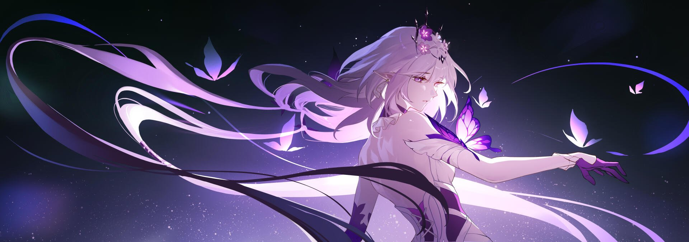
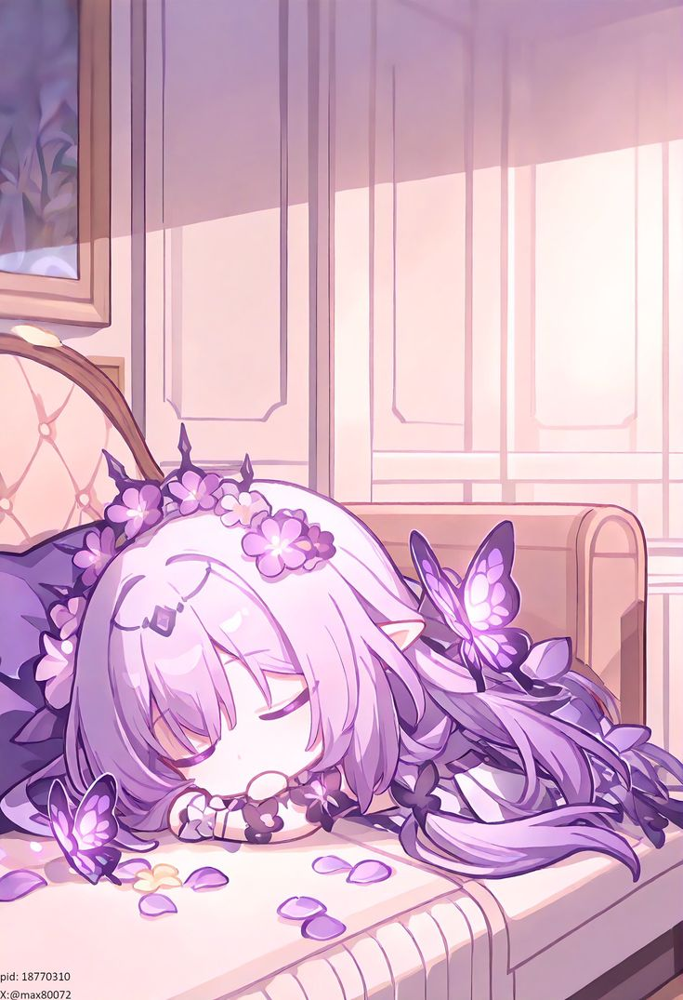
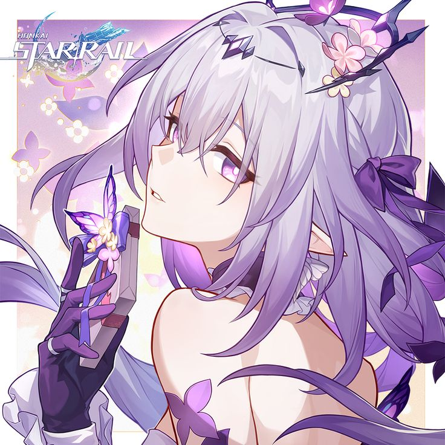

<!-- Banner -->

  

 

<!-- Title -->

  <h1>🌸 WangYi / 王毅</h1>
  
<em>“The Unemployed Ohio Final Boss 🇺🇸💀”</em>

---

<!-- About Me -->
<table>
  <tr>
    <td width="65%" valign="top">

### ☕ 关于我 | About Me

- 📛 **名字 Name:** WangYi / 王毅  
- 🗺️ **所在地 Location:** Vietnam 越南  
- 🐱 **称呼 Pronouns:** 小喵 (Xiǎo Miāo)  
- 🏠 **状态 Status:** NEET / 在家蹲  
- 🌐 **语言 Languages:** Vietnamese, English, 中文  
- ❤️ **我爱 I Love:** Lumi  

</td>
<td width="35%" align="center">
  
</td>
  </tr>
</table>

---

<!-- Tech Interests -->
<table>
  <tr>
    <td width="65%" valign="top">

### 💡 技术 & 兴趣 | Tech & Interests

- 😴 懒惰，但热爱技术  
- 🎭 动漫、Cosplay、游戏脚本  
- 👾 专注于 Discord Bot、Web API、前端界面  
- 🌈 “我只是随便写点奇怪代码，欣赏 RGB 灯光而已~”  

</td>
<td width="35%" align="center">
  
</td>
  </tr>
</table>

---

<!-- Live Discord Status -->
<h2 align="center">🟢 Discord 状态 | Live Discord Status</h2>

  

---

<!-- GitHub Stats -->
<h2 align="center">📊 GitHub 统计 | GitHub Stats</h2>

  
  

---

<!-- Contact Section -->
<table>
  <tr>
    <td width="65%" valign="top">

### 📫 联系我 | Contact Me

- 💬 **Discord:** [`@WangYi#0001`](https://discord.com/users/1391995229241868459) *(最快速方式)*  
- 📧 **Email:** [wangyiisyi20@gmail.com](mailto:wangyiisyi20@gmail.com)  
- 🖱️ **GitHub:** [wangyi68](https://github.com/wangyi68)  
- 🎮 **Steam:** [WangYi](https://steamcommunity.com/id/MiyagawaMizu)  

  
    
  
  
  
  

</td>
<td width="35%" align="center">
  
</td>
  </tr>
</table>

---

<!-- Footer -->

  <i>✨ 谢谢你来看！让我们一起沉迷 RGB 灯光、动漫，还有那些技术宅小玩意！ 
     ✨ Thanks for visiting! Let’s geek out over anime, RGB setups, and cursed code.</i>
    
  

